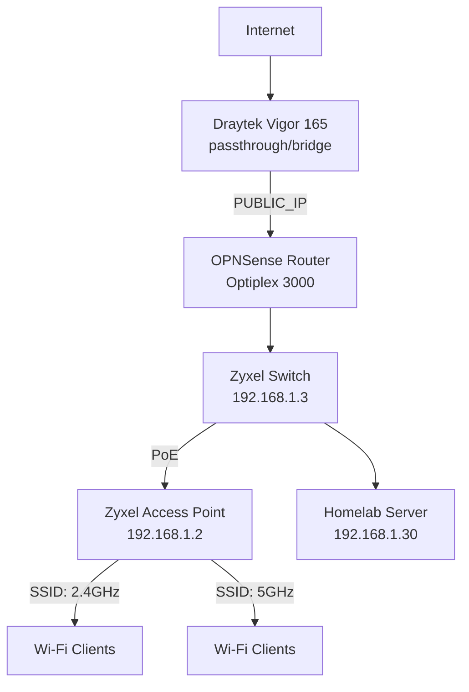
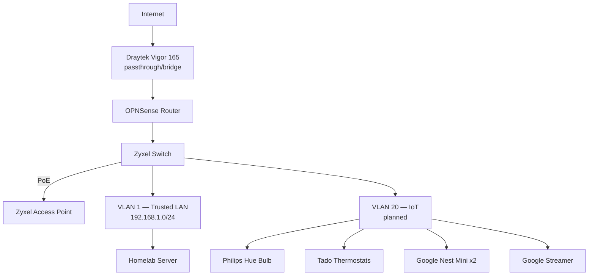

# Network

## Overview

| Device | Role | Model | IP |
|---|---|---|---|
| Modem | ISP modem, running in passthrough/bridge mode (no routing/NAT) | Draytek Vigor 165 | — |
| Router / Firewall | OPNSense (bare-metal, on a Dell Optiplex 3000 thin client, 16 GB RAM) | Dell Optiplex 3000 | `TODO_ROUTER_IP` |
| Switch | Managed switch, provides PoE to the access point | Zyxel | `192.168.1.3` |
| Access Point | Dual-band Wi-Fi, 2 SSIDs (2.4 GHz + 5 GHz), powered via PoE from the switch | Zyxel | `192.168.1.2` |
| Homelab Server | Docker host | i7-6700K / Debian 12 | `192.168.1.30` |

!!! note "Passthrough modem"
    The Draytek Vigor 165 just bridges the ISP connection through to OPNSense — it doesn't do routing or NAT itself, so OPNSense is the actual gateway/firewall for the network.

!!! note "WAN/public IP"
    The router's WAN-facing public IP is intentionally left as a placeholder (`<PUBLIC_IP>`) even though the LAN addresses above are published as-is — the LAN side isn't reachable from the internet, but the public IP is.

## Current topology (flat network)

There's no VLAN segmentation yet — every device, including IoT gear, sits on the same `192.168.1.0/24` subnet.

## Planned: IoT VLAN

Segmenting IoT devices onto their own VLAN behind OPNSense is planned but not yet implemented. Once it's live, this section should move to "Current topology" and the devices below should get real IPs in the table.

Devices planned to move to the IoT VLAN:

- Philips Hue Wi-Fi bulb
- Tado smart thermostats
- Google Nest Mini x2
- Google Chromecast / Streamer
- Any new IoT devices going forward

!!! warning "Why this matters"
    IoT devices are historically weak points — segmenting them means a compromised bulb or speaker can't reach the homelab server or anything else on the trusted LAN.
